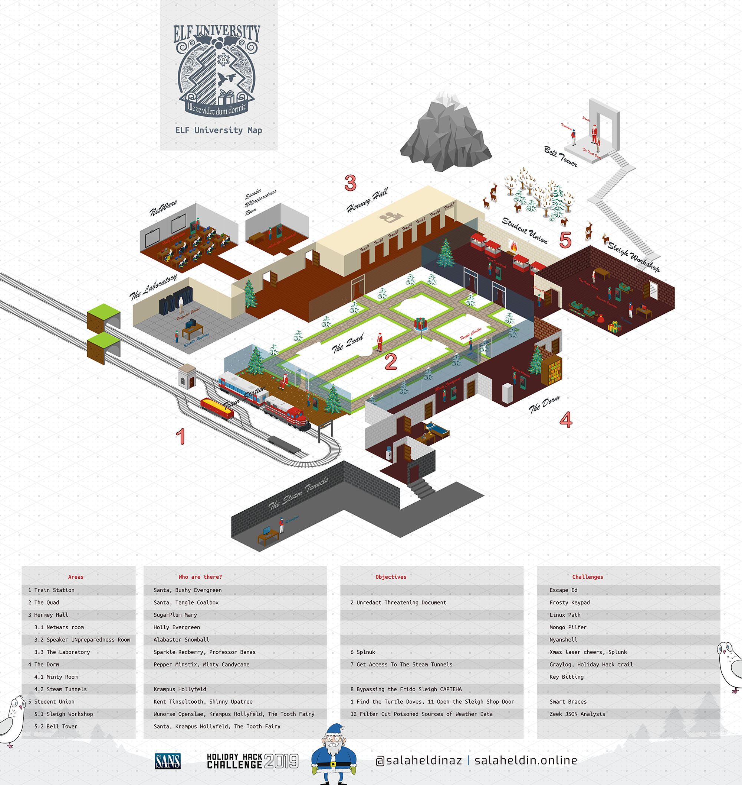

# kringlecon-2-2019
Detailed technical write-up for KRINGLECON 2 CTF
by [Salaheldin](https://twitter.com/salaheldinaz)

Please Visit https://kringlecon2.salaheldin.online/ to view the writeup

---

## 🗺 Map

This a preview of a very high quality map for ELF University, to zoom and check the details please download the full quality. [click here](/images/kringlecon-map.png):

---

## 🏵 Objectives

Check the objectives in your badge, You will have the 6 objectives then unlock new objective by talking to the elves you find in the university:

| Objective | Type | Location | Tools |
| --------- | ---- | -------- | :---: |
| [**0/ Talk to Santa in the Quad**](/objectives/objective0) | Talk | The Quad | |
| [**1/ Find the Turtle Doves**](/objectives/objective1) | Explore | The student union | |
| [**2/ Unredact Threatening Document**](/objectives/objective2) | Explore | The Quad | |
| [**3/ Windows Log Analysis**: Evaluate Attack Outcome](/objectives/objective3) | Logs Analysis | [The event log data](https://downloads.elfu.org/Security.evtx.zip) | DeepBlueCLI
| [**4/ Windows Log Analysis**: Determine Attacker Technique](/objectives/objective4) | Logs Analysis | [The normalized Sysmon logs](https://downloads.elfu.org/sysmon-data.json.zip) | EQL
| [**5/ Windows Log Analysis**: Determine Compromised System](/objectives/objective5) | Logs Analysis | [Zeek logs](https://downloads.elfu.org/elfu-zeeklogs.zip) | RITA
| [**6/ Spunk**](/objectives/objective6) | SOC | [Splnuk Server](https://splunk.elfu.org/) | Splunk
| [**7/ Get Access To The Steam Tunnels**](/objectives/objective7) | Multi | Minty's dorm room | Multi  
| [**8/ Bypassing the Frido Sleigh CAPTEHA**](/objectives/objective8) | Machine Learning | [fridosleigh](https://fridosleigh.com) | Python
| [**9/ Retrieve Scraps of Paper from Server**](/objectives/objective9)| SQL Injection | [Student Portal](https://studentportal.elfu.org/) | Sqlmap
| [**10/ Recover Cleartext Document**](/objectives/objective10) | Reverse Engineering | [elfscrow app](https://downloads.elfu.org/elfscrow.exe) | IDA
| [**11/ Open the Sleigh Shop Door**](/objectives/objective11) | Web Dev | [Carte](https://crate.elfu.org/) | Web Dev
| [**12/ Filter Out Poisoned Sources of Weather Data**](/objectives/objective12) | Logs Analysis | [SLEIGH ROUTE FINDER API](https://srf.elfu.org/) | jq

---

## 🎗Helping the elves Challenges

As we walk around, we can find various challenges, and as we talk to the elves standing near them, we get some hints.

Challenge | Type | Direct Url | Elf | Location |
--------- |:----:|:---------: | --- | --------|
[**1 Escape Ed**](/helptheelves/challenge1) | Ed editor | [Link](https://docker2019.kringlecon.com/?challenge=edescape&id=ef59b992-558d-4580-b5a0-9cfa0d19f1df) | Bushy Evergreen | The train station |
[**2 Linux Path**](/helptheelves/challenge2) | Linux | [Link](https://docker2019.kringlecon.com/?challenge=path&id=ef59b992-558d-4580-b5a0-9cfa0d19f1df) | SugarPlum Mary | The Hermey Hall |
[**3 Xmas laser cheers**](/helptheelves/challeng3) | Powershell | [Link](https://docker2019.kringlecon.com/?challenge=powershell&id=ef59b992-558d-4580-b5a0-9cfa0d19f1df) | Sparkle Redberry | The Laboratory
[**4 Splunk - The training questions**](/helptheelves/challenge4) | SOC - Splunk | [Link](https://splunk.elfu.org) | Professor Banas | The Laboratory
[**5 Mongo Pilfer**](/helptheelves/challenge5) | MongoDB | [Link](https://docker2019.kringlecon.com/?challenge=mongo&id=ef59b992-558d-4580-b5a0-9cfa0d19f1df) | Holly Evergreen | Netwars Room
[**6 Nyanshell**](/helptheelves/challenge6) | Linux Shell | [Link](https://docker2019.kringlecon.com/?challenge=nyanshell&id=ef59b992-558d-4580-b5a0-9cfa0d19f1df) | Alabaster Snowball | The Speaker UNpreparedness Room
[**7 Frosty Keypad**](/helptheelves/challenge7)| Keypad | [Link](https://docker2019.kringlecon.com/?challenge=keypad&id=ef59b992-558d-4580-b5a0-9cfa0d19f1df) | Tangle Coalbox | The Quad
[**8 Holiday Hack trail**](/helptheelves/challenge8) | Web Pentest | [Link](https://trail.elfu.org/)| Minty Candycane | The Dorm
[**9 Get Access To The Steam Tunnels**](/helptheelves/challenge9) | Key Bitting | [Link1](https://key.elfu.org/) [Link2](https://thisisit.elfu.org/) | Krampus | Minty's Room
[**10 Graylog**](/helptheelves/challenge10) | Log Analysis | [Link](https://graylog.elfu.org/) | Pepper Minstix | The Dorm
[**11Smart Braces**](/helptheelves/challenge11) | Iptables | [link](https://docker2019.kringlecon.com/?challenge=iptables&id=ef59b992-558d-4580-b5a0-9cfa0d19f1df) | Kent Tinseltooth | Student Union
[**12 Zeek JSON Analysis**](/helptheelves/challenge12) | Log Analysis | [Link](https://docker2019.kringlecon.com/?challenge=jq&id=ef59b992-558d-4580-b5a0-9cfa0d19f1df) | Wunorse Openslae | Sleigh Shop

---

## Resources

Virtual Machines I used:

- [Slingshot](https://www.sans.org/slingshot-vmware-linux/download) from SANS.

- [Windows 10 VM](https://developer.microsoft.com/en-us/windows/downloads/virtual-machines)

Recording terminal:

- [asciinema](https://asciinema.org/)

---
